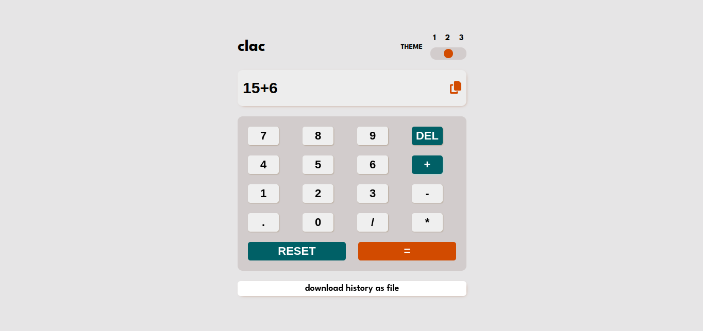
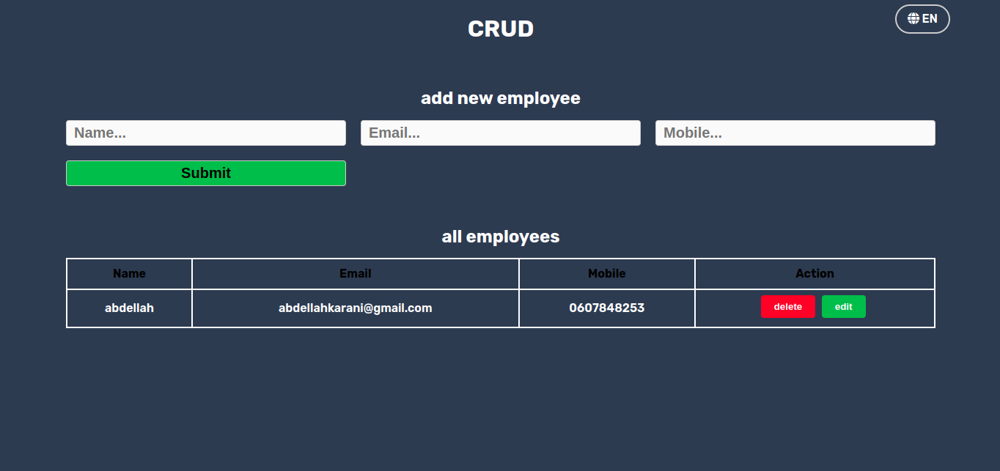
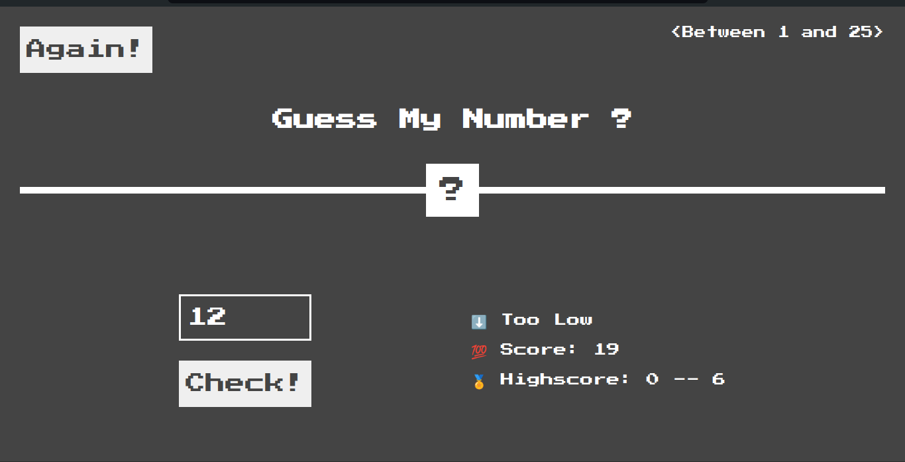
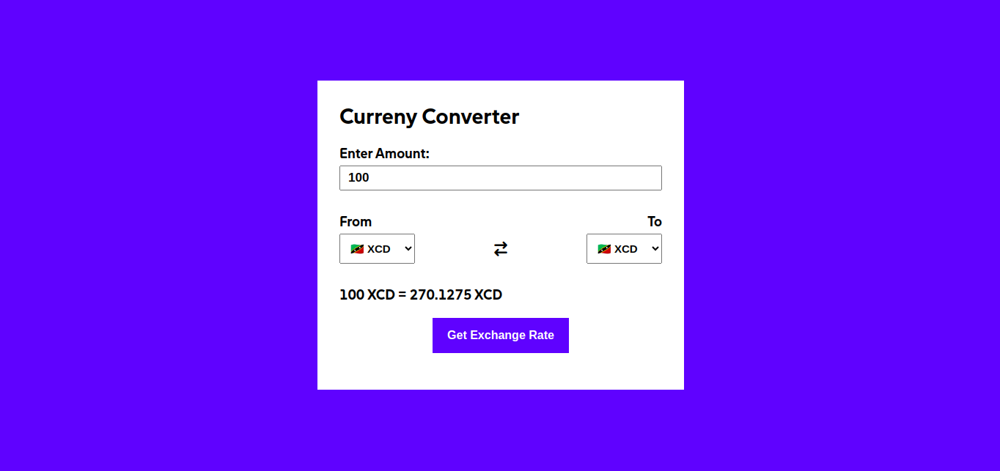
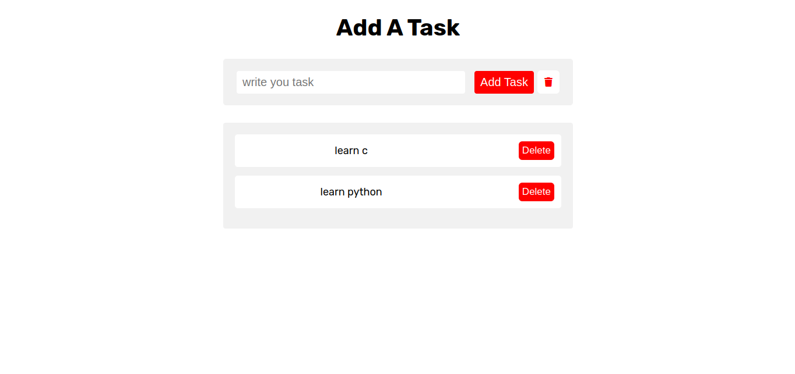

## Demo: [!vanilla_projects](https://karaniabdellah.github.io/vanilla_projects/)

## Project Descriptions

This table displays a list of all projects.
| Project Name             | Description                             |
| ------------------------ | --------------------------------------- |
| Color Flipper            | A tool to change colors randomly.      |
| Counter                  | A simple counter that increments.      |
| Our Reviews              | A page to display user reviews.        |
| Coding Addict            | A fun quiz about coding.               |
| Sidebar                  | A collapsible sidebar for navigation.  |
| Model                    | A simple model viewer.                 |
| General Questions        | A FAQ page with common questions.      |
| Our Menu                 | A menu display for a restaurant.       |
| Video Play               | A video player with basic controls.    |
| Scroll                   | A smooth scrolling effect demo.        |
| Tabs                     | A tabbed interface for content.        |
| Countdown                | A countdown timer to an event.         |
| Add Task                 | A task manager to add and remove tasks.| 
| Generate Paragraph        | Generates random paragraphs.           |
| Grocery Bud              | A grocery list manager.                |
| Gallery                  | A simple image gallery.                |
| Tic Tac Toe              | A playable Tic Tac Toe game.           |
| Generate Password        | Creates strong passwords.               |
| Simple Website           | A basic static website template.       |
| Calculator App           | A simple calculator for basic math.    |
| Form Validation          | Validates user input in a form.       |
| CRUD Project             | A simple Create, Read, Update, Delete app. |
| Alarm                    | An alarm clock with basic features.    |
| Palette Generator        | Generates color palettes.               |
| Dictionary App           | A simple dictionary lookup tool.       |
| Generate Portfolio       | Creates a basic portfolio page.        |
| Currency Converter       | Converts currency values.               |
| File Downloader          | Allows users to download files.        |
| Toast Notifications      | Displays temporary notifications.       |
| Guess Number Game       | A fun game to guess a random number.   |

## Screenshots

## Contributors

Thank you to everyone who contributed to this project!

© Abdellah Karani 2024. All rights reserved.

